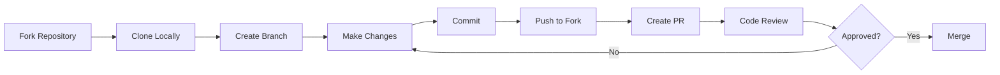

# Development Workflow

This guide walks you through the step-by-step process for contributing code to Centabit v0.5.

## Prerequisites

Before you begin, make sure you have:
- [ ] A GitHub account
- [ ] Git installed locally
- [ ] Flutter SDK installed (see [setup guide](/getting-started/for-developers))
- [ ] Read the [Code of Conduct](./code-of-conduct)
- [ ] Reviewed the [Architecture Overview](/architecture/)

## Workflow Overview



## Step-by-Step Guide

### 1. Fork the Repository

1. Navigate to the [Centabit repository](https://github.com/domain80/centabit_v0.5)
2. Click the **Fork** button in the top-right corner
3. Select your GitHub account as the destination
4. Wait for GitHub to create your fork

### 2. Clone Your Fork

Clone your forked repository to your local machine:

```bash
# Replace YOUR-USERNAME with your GitHub username
git clone https://github.com/YOUR-USERNAME/centabit_v0.5.git
cd centabit_v0.5
```

### 3. Add Upstream Remote

Add the original repository as an upstream remote to keep your fork in sync:

```bash
git remote add upstream https://github.com/domain80/centabit_v0.5.git
git remote -v  # Verify remotes
```

You should see:
- `origin` - Your fork (where you push changes)
- `upstream` - Original repo (where you pull updates)

### 4. Set Up Development Environment

Install dependencies and verify everything works:

```bash
# Install Flutter dependencies
flutter pub get

# Generate code for Freezed, Drift, etc.
flutter pub run build_runner build --delete-conflicting-outputs

# Verify setup
flutter analyze
flutter doctor -v
```

See [Development Guide](/development/) for detailed development commands.

### 5. Create a Feature Branch

Always create a new branch for your work. **Never commit directly to `main`.**

#### Branch Naming Convention

Use descriptive branch names with these prefixes:

- `feature/` - New features or enhancements
  - Example: `feature/recurring-transactions`
- `fix/` - Bug fixes
  - Example: `fix/budget-calculation-error`
- `docs/` - Documentation changes
  - Example: `docs/add-testing-guide`
- `refactor/` - Code refactoring (no behavior change)
  - Example: `refactor/simplify-dashboard-cubit`
- `test/` - Adding or updating tests
  - Example: `test/transaction-repository-tests`
- `chore/` - Maintenance tasks (dependencies, config)
  - Example: `chore/update-flutter-sdk`

#### Create Your Branch

```bash
# Ensure you're on main and up-to-date
git checkout main
git pull upstream main

# Create and switch to your new branch
git checkout -b feature/your-feature-name
```

### 6. Make Your Changes

Now you're ready to code! Follow these guidelines:

#### Code Quality Standards

- **Follow existing patterns**: Study similar code in the project (see [Patterns & Conventions](/development/patterns-and-conventions))
- **Use MVVM architecture**: Place code in the correct layer (see [Architecture Overview](/architecture/))
- **Follow Dart conventions**: Use `lowerCamelCase` for variables, `UpperCamelCase` for classes
- **Add comments**: Explain complex logic, but avoid obvious comments
- **Keep it simple**: Prefer clarity over cleverness

#### Key Patterns to Follow

**Freezed Models** (for data classes and states):
```dart
@freezed
class TransactionModel with _$TransactionModel {
  const factory TransactionModel({
    required String id,
    required double amount,
    required DateTime date,
  }) = _TransactionModel;

  factory TransactionModel.fromJson(Map<String, dynamic> json) =>
      _$TransactionModelFromJson(json);
}
```

**Repository Pattern** (all data access):
```dart
class TransactionRepository {
  final TransactionLocalSource _localSource;

  Stream<List<TransactionModel>> get transactionsStream => _transactionsController.stream;
  List<TransactionModel> get transactions => _latestTransactions;

  Future<void> createTransaction(TransactionModel model) async {
    await _localSource.createTransaction(/* ... */);
  }
}
```

**Cubit State Management**:
```dart
class TransactionListCubit extends Cubit<TransactionListState> {
  final TransactionRepository _repository;
  StreamSubscription? _subscription;

  TransactionListCubit(this._repository) : super(const TransactionListState.initial()) {
    _subscription = _repository.transactionsStream.listen((_) => _loadData());
    _loadData();
  }

  @override
  Future<void> close() {
    _subscription?.cancel();
    return super.close();
  }
}
```

See [Architecture](/architecture/) and [Development Patterns](/development/patterns-and-conventions) for complete architectural patterns.

#### Testing Your Changes

Run these commands before committing:

```bash
# Format code (required)
flutter format .

# Analyze code (must pass)
flutter analyze

# Run tests (if tests exist)
flutter test

# Test on a device/emulator
flutter run
```

#### Regenerate Code After Changes

If you modified:
- `@freezed` classes
- Drift database schema
- `@JsonSerializable` classes

Run code generation:

```bash
flutter pub run build_runner build --delete-conflicting-outputs
```

### 7. Commit Your Changes

Write clear, descriptive commit messages that explain **why** the change was made, not just what changed.

#### Commit Message Format

```
type: brief description (50 chars or less)

Optional longer explanation of what changed and why.
Can span multiple lines. Wrap at 72 characters.

- Bullet points are okay
- Use present tense: "add" not "added"
- Reference issues: "Closes #123"
```

#### Commit Types

- `feat:` - New feature
- `fix:` - Bug fix
- `docs:` - Documentation changes
- `refactor:` - Code refactoring
- `test:` - Adding/updating tests
- `chore:` - Maintenance (dependencies, build)
- `style:` - Formatting, whitespace (no code change)

#### Examples

**Good commit messages:**
```bash
git commit -m "feat: add category filter to transaction list

Allows users to filter transactions by category on the
transactions page. Adds CategoryFilterWidget with search
and multi-select support.

Closes #47"
```

```bash
git commit -m "fix: prevent negative amounts in budget form

Adds validation to ensure budget amounts are positive.
Shows error message when user enters negative value.

Fixes #89"
```

**Poor commit messages:**
```bash
git commit -m "updates"  # Too vague
git commit -m "Fixed bug"  # What bug?
git commit -m "WIP"  # Not descriptive
```

#### Commit Best Practices

- **Commit often**: Make small, logical commits
- **Atomic commits**: Each commit should be a complete, working change
- **Test before committing**: Ensure code works
- **One concern per commit**: Don't mix unrelated changes

```bash
# Stage specific files
git add lib/features/transactions/presentation/widgets/category_filter.dart
git commit -m "feat: add category filter widget"

# Or stage all changes
git add .
git commit -m "fix: correct budget calculation in dashboard"
```

### 8. Keep Your Branch Updated

While you're working, the main branch may receive updates. Keep your branch in sync:

```bash
# Fetch latest changes from upstream
git fetch upstream

# Merge upstream main into your branch
git checkout your-branch-name
git merge upstream/main

# Or use rebase for a cleaner history (advanced)
git rebase upstream/main
```

If you encounter conflicts:

```bash
# 1. Open conflicted files and resolve conflicts
# 2. Mark as resolved
git add resolved-file.dart

# 3. Continue merge or rebase
git merge --continue  # if merging
git rebase --continue  # if rebasing
```

### 9. Push Your Changes

Push your branch to your fork on GitHub:

```bash
# First push
git push origin your-branch-name

# If you rebased, you may need to force push (use with caution!)
git push origin your-branch-name --force-with-lease
```

### 10. Create a Pull Request

1. Navigate to your fork on GitHub
2. Click **"Compare & pull request"** (appears after pushing)
3. Fill out the PR template:

#### Pull Request Title

Use the same format as commit messages:
- `feat: add category-based budget allocation`
- `fix: resolve crash on empty transaction list`
- `docs: improve repository pattern documentation`

#### Pull Request Description

Provide context and details:

```markdown
## Summary
Brief description of what this PR does and why.

## Changes Made
- Added CategoryFilter widget to transaction list page
- Updated TransactionListCubit to support category filtering
- Added filter icon to navigation bar

## Testing
- [ ] Tested on Android
- [ ] Tested on iOS
- [ ] Tested on Web
- [ ] Added unit tests
- [ ] Added widget tests

## Screenshots
[Add screenshots or GIFs demonstrating changes]

## Related Issues
Closes #47
Related to #52

## Checklist
- [ ] Code follows project conventions
- [ ] `flutter analyze` passes
- [ ] `flutter format` applied
- [ ] Tests added/updated
- [ ] Documentation updated
```

4. Select **main** as the base branch
5. Click **"Create pull request"**

### 11. Code Review Process

Once you submit your PR:

1. **Automated Checks**: CI/CD will run (when configured)
   - Linter checks
   - Tests
   - Build verification

2. **Maintainer Review**: A project maintainer will review your code
   - They may request changes
   - They may ask questions
   - They may suggest improvements

3. **Address Feedback**: If changes are requested:
   ```bash
   # Make requested changes
   git add .
   git commit -m "refactor: address PR review feedback"
   git push origin your-branch-name
   ```
   The PR will update automatically.

4. **Approval & Merge**: Once approved:
   - Maintainer merges your PR
   - Your branch can be deleted
   - Your contribution is live!

#### Review Timeline

- **Initial review**: Usually within 2-3 days
- **Follow-up**: 1-2 days after addressing feedback
- Be patient - maintainers are volunteers!

### 12. After Your PR is Merged

Celebrate and clean up:

```bash
# Switch back to main
git checkout main

# Pull the latest changes (including your merged PR)
git pull upstream main

# Delete your local feature branch (optional)
git branch -d your-branch-name

# Delete remote branch on your fork (optional)
git push origin --delete your-branch-name
```

You can now start working on your next contribution!

## Tips for Success

### Before You Start

- **Check existing issues**: Someone may already be working on it
- **Discuss major changes**: Open an issue first for big features
- **Start small**: Pick "good first issue" labels if you're new
- **Ask questions**: No question is too basic

### While Working

- **Commit frequently**: Small commits are easier to review
- **Test thoroughly**: Try to break your own code
- **Document as you go**: Update docs alongside code
- **Stay focused**: One feature per PR

### Common Pitfalls to Avoid

- ❌ Working directly on `main` branch
- ❌ Mixing multiple unrelated changes in one PR
- ❌ Forgetting to run `flutter format`
- ❌ Not testing on actual devices
- ❌ Making PRs too large (harder to review)
- ❌ Forgetting to update documentation

## Getting Help

Stuck? Here's how to get help:

- **Check documentation**: [Architecture](/architecture/), [Development Guide](/development/)
- **Search issues**: Your question may already be answered
- **Ask in your PR**: Maintainers can provide guidance
- **Open a discussion**: For broader questions

## Advanced Topics

### Working with Database Changes

If you modify the Drift schema:

```bash
# Update database.dart
# Run code generation
flutter pub run build_runner build --delete-conflicting-outputs

# Test with hot restart (not hot reload)
flutter run
```

Database changes require full app restart during development.

### Adding New Features

Follow the [feature creation workflow](/development/patterns-and-conventions#adding-a-new-feature):

1. Create feature directory structure
2. Define data models with `@freezed`
3. Add database table (if needed)
4. Create LocalSource with userId filtering
5. Create Repository with broadcast streams
6. Define Cubit state
7. Implement Cubit logic
8. Register in dependency injection
9. Build UI (pages and widgets)
10. Add routes
11. Run code generation

### Working with Forms

Use the modal form pattern (see `BudgetFormModal`, `TransactionFormModal`):
- `showModalBottomSheetUtil()` helper
- BlocProvider scoped to modal
- FormBuilder for form state
- BlocListener for success/error handling

## Related Documentation

- [Testing Guidelines](./testing-guidelines) - How to write tests
- [Patterns & Conventions](/development/patterns-and-conventions) - Code standards
- [Architecture Overview](/architecture/) - System design
- [Architecture Documentation](/architecture/) - Complete technical reference

---

**Ready to contribute?** Find an issue, create a branch, and let's build something great together!

Questions about the workflow? Open an issue with the `question` label.
