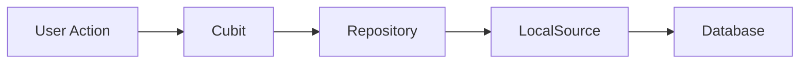
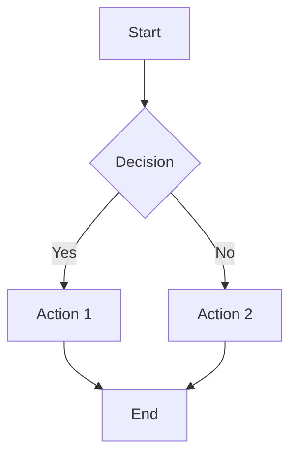
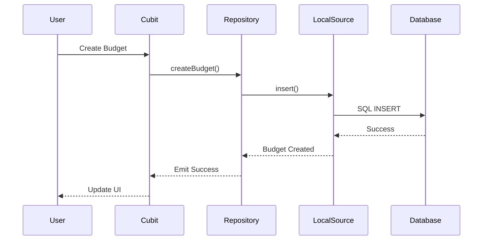

# Documentation Guide

Contributing to Centabit's documentation is a valuable way to help the project, even if you don't write code. This guide explains how to improve, expand, and maintain our documentation site.

## Why Documentation Matters

Good documentation:
- **Helps New Users**: Get started quickly and confidently
- **Supports Developers**: Understand architecture and patterns
- **Reduces Support Burden**: Answers common questions proactively
- **Builds Community**: Invites more contributors by lowering barriers
- **Preserves Knowledge**: Documents decisions and rationale

## Documentation Structure

Centabit's documentation is built with **VitePress**, a static site generator powered by Vite and Vue.

### Site Structure

```
docs/
├── .vitepress/
│   ├── config.ts              # VitePress configuration
│   └── theme/                 # Custom theme (if any)
├── index.md                   # Homepage
├── getting-started/           # Setup and quickstart guides
│   ├── index.md
│   ├── for-users.md
│   └── for-developers.md
├── architecture/              # Technical architecture docs
│   ├── index.md
│   ├── mvvm-pattern.md
│   ├── data-layer.md
│   └── state-management.md
├── development/               # Development guides
│   ├── index.md
│   ├── patterns-and-conventions.md
│   └── debugging.md
├── contributing/              # Contribution guides (this section!)
│   ├── index.md
│   ├── development-workflow.md
│   ├── design-contributions.md
│   ├── testing-guidelines.md
│   └── documentation-guide.md
├── user-guide/                # End-user documentation
│   ├── index.md
│   ├── creating-budgets.md
│   ├── tracking-transactions.md
│   └── faq.md
├── api-reference/             # API documentation (future)
└── roadmap/                   # Project roadmap and plans
    ├── index.md
    └── future-enhancements.md
```

## Getting Started

### Prerequisites

- Node.js 18+ installed
- Git for version control
- Text editor (VS Code recommended)

### Local Development Setup

1. **Clone the repository**:
```bash
git clone https://github.com/YOUR-USERNAME/centabit_v0.5.git
cd centabit_v0.5
```

2. **Install dependencies**:
```bash
npm install
```

3. **Start development server**:
```bash
npm run docs:dev
```

4. **Open in browser**:
Navigate to `http://localhost:5173` (or the port shown in terminal)

The site will hot-reload as you make changes!

### Building for Production

```bash
# Build static site
npm run docs:build

# Preview production build
npm run docs:preview
```

Built files are output to `docs/.vitepress/dist/`.

## Writing Documentation

### Markdown Basics

VitePress uses GitHub Flavored Markdown with additional features.

#### Headings

```markdown
# H1 - Page Title (use once per page)
## H2 - Major Sections
### H3 - Subsections
#### H4 - Minor Subsections
```

#### Text Formatting

```markdown
**Bold text**
*Italic text*
***Bold and italic***
~~Strikethrough~~
`Inline code`
```

#### Links

```markdown
[Link text](https://example.com)
[Internal link](/getting-started/for-developers)
[Link with title](https://example.com "Hover title")
```

**Internal link tips**:
- Use relative paths for docs pages: `/architecture/mvvm-pattern`
- Omit `.md` extension
- Use lowercase and hyphens for URLs

#### Lists

```markdown
Unordered list:
- Item 1
- Item 2
  - Nested item
  - Another nested item

Ordered list:
1. First item
2. Second item
3. Third item
```

#### Code Blocks

````markdown
```dart
// Specify language for syntax highlighting
class BudgetModel {
  final String id;
  final double amount;
}
```

```bash
flutter pub get
flutter run
```
````

**Supported languages**: `dart`, `bash`, `json`, `yaml`, `typescript`, `javascript`, `html`, `css`, and more.

#### Blockquotes

```markdown
> This is a quote or callout
> Can span multiple lines
```

#### Tables

```markdown
| Column 1 | Column 2 | Column 3 |
|----------|----------|----------|
| Data 1   | Data 2   | Data 3   |
| Data 4   | Data 5   | Data 6   |
```

### VitePress-Specific Features

#### Frontmatter

Add metadata at the top of each page:

```markdown
---
title: Page Title
description: Brief description for SEO
---

# Page Title

Content starts here...
```

#### Custom Containers

VitePress provides styled callout boxes:

```markdown
::: info
This is an info box.
:::

::: tip
This is a tip.
:::

::: warning
This is a warning.
:::

::: danger
This is a danger notice.
:::

::: details Click to expand
Hidden content that reveals on click.
:::
```

Rendered output:

::: info
This is an info box for informational content.
:::

::: tip
This is a tip box for helpful suggestions.
:::

::: warning
This is a warning box for important cautions.
:::

::: danger
This is a danger box for critical warnings.
:::

#### Code Groups

Show multiple code examples with tabs:

````markdown
::: code-group
```dart [Model]
class BudgetModel {
  final String id;
  final double amount;
}
```

```dart [Repository]
class BudgetRepository {
  Future<Budget> getBudget(String id) async {
    // Implementation
  }
}
```
:::
````

#### Line Highlighting

Highlight specific lines in code blocks:

````markdown
```dart {2-4}
class BudgetModel {
  final String id;        // Highlighted
  final double amount;    // Highlighted
  final DateTime date;    // Highlighted
}
```
````

#### Badges

Add inline badges for status or versions:

```markdown
New feature <Badge type="tip" text="v0.5" />
Deprecated <Badge type="warning" text="deprecated" />
Breaking change <Badge type="danger" text="breaking" />
```

### Writing Style Guidelines

#### Be Clear and Concise

**Good**:
> To create a budget, tap the "Add Budget" button on the Budgets page.

**Poor**:
> In order to effectuate the creation of a new budgetary allocation, one must navigate to the budget management interface and subsequently actuate the addition mechanism.

#### Use Active Voice

**Good**:
> The repository loads data from the database.

**Poor**:
> Data is loaded from the database by the repository.

#### Write for Your Audience

**For Users** (non-technical):
- Use simple, plain language
- Avoid jargon and technical terms
- Provide step-by-step instructions
- Include screenshots when helpful

**For Developers** (technical):
- Use precise technical terminology
- Include code examples
- Link to source code
- Explain architectural decisions

#### Structure Content Logically

1. **Start with overview**: What is this about?
2. **Provide context**: Why does this matter?
3. **Give instructions**: How do I use/implement this?
4. **Show examples**: Working code or screenshots
5. **Link to related content**: Where can I learn more?

#### Use Consistent Terminology

Maintain consistency with existing docs:
- **Budget** (not "spending plan" or "allocation")
- **Transaction** (not "expense" or "purchase")
- **Category** (not "tag" or "type")
- **Cubit** (not "controller" or "view model")
- **Repository** (not "service" or "data source")

## Common Documentation Tasks

### Adding a New Page

1. **Create markdown file** in appropriate directory:
```bash
# Example: Adding a new architecture doc
touch docs/architecture/data-flow.md
```

2. **Add frontmatter and content**:
```markdown
---
title: Repository Pattern
description: Understanding the repository pattern in Centabit
---

# Repository Pattern

Explanation of the repository pattern...
```

3. **Update navigation** in `docs/.vitepress/config.ts`:
```typescript
sidebar: {
  '/architecture/': [
    {
      text: 'Architecture',
      items: [
        { text: 'Overview', link: '/architecture/' },
        { text: 'MVVM Pattern', link: '/architecture/mvvm-pattern' },
        { text: 'Data Flow', link: '/architecture/data-flow' }, // New entry
      ]
    }
  ]
}
```

4. **Test locally**:
```bash
npm run docs:dev
```

5. **Create pull request** with your changes.

### Improving an Existing Page

1. **Find the page** in `docs/` directory
2. **Make your edits** in markdown
3. **Preview changes** locally (`npm run docs:dev`)
4. **Commit with clear message**:
```bash
git add docs/architecture/data-flow.md
git commit -m "docs: clarify repository stream usage"
```

### Adding Code Examples

**Include complete, runnable examples**:

````markdown
Here's how to create a repository:

```dart
class BudgetRepository {
  final BudgetLocalSource _localSource;
  final _budgetsController = StreamController<List<BudgetModel>>.broadcast();

  BudgetRepository(this._localSource) {
    _dbSubscription = _localSource.watchAllBudgets().listen((budgets) {
      final models = budgets.map(_mapToModel).toList();
      _budgetsController.add(models);
    });
  }

  Stream<List<BudgetModel>> get budgetsStream => _budgetsController.stream;
}
```

This repository:
- Takes a `LocalSource` as dependency
- Creates a broadcast stream for reactive updates
- Subscribes to database changes
- Transforms database entities to domain models
````

**Link to source code** when possible:
```markdown
See the full implementation in [`BudgetRepository`](/lib/data/repositories/budget_repository.dart).
```

### Adding Screenshots

1. **Take screenshot** (use device frame for app screenshots)
2. **Optimize image** (compress to reduce file size)
3. **Add to assets** directory:
```bash
mkdir -p docs/public/images/user-guide
cp screenshot.png docs/public/images/user-guide/budget-creation.png
```

4. **Reference in markdown**:
```markdown

```

**Tips for good screenshots**:
- Use consistent device/browser
- Highlight important areas (arrows, boxes)
- Use light theme for clarity (unless showing dark mode)
- Include captions explaining what's shown

### Creating Diagrams

Use **Mermaid** for diagrams (supported in VitePress):

````markdown

````

**Common diagram types**:

**Flowchart**:
````markdown

````

**Sequence diagram**:
````markdown

````

## Documentation Checklist

Before submitting documentation changes:

- [ ] Content is accurate and up-to-date
- [ ] Code examples are tested and work
- [ ] Links are valid (internal and external)
- [ ] Spelling and grammar are correct
- [ ] Formatting is consistent with existing docs
- [ ] Navigation is updated (if adding new pages)
- [ ] Images are optimized and have alt text
- [ ] Local preview looks correct (`npm run docs:dev`)
- [ ] Frontmatter is complete (title, description)
- [ ] Related pages are cross-linked

## VitePress Configuration

### Sidebar Navigation

Edit `docs/.vitepress/config.ts` to configure sidebar:

```typescript
export default defineConfig({
  themeConfig: {
    sidebar: {
      '/getting-started/': [
        {
          text: 'Getting Started',
          items: [
            { text: 'Overview', link: '/getting-started/' },
            { text: 'For Users', link: '/getting-started/for-users' },
            { text: 'For Developers', link: '/getting-started/for-developers' },
          ]
        }
      ],
      '/architecture/': [
        {
          text: 'Architecture',
          collapsible: true,
          items: [
            { text: 'Overview', link: '/architecture/' },
            { text: 'MVVM Pattern', link: '/architecture/mvvm-pattern' },
            { text: 'Data Layer', link: '/architecture/data-layer' },
          ]
        }
      ]
    }
  }
})
```

### Top Navigation

```typescript
export default defineConfig({
  themeConfig: {
    nav: [
      { text: 'Home', link: '/' },
      { text: 'Guide', link: '/getting-started/' },
      { text: 'Architecture', link: '/architecture/' },
      { text: 'Contributing', link: '/contributing/' },
    ]
  }
})
```

### Search

VitePress includes built-in search. Configure in `config.ts`:

```typescript
export default defineConfig({
  themeConfig: {
    search: {
      provider: 'local'
    }
  }
})
```

## Style Guide

### Headings

- Use sentence case: "Getting started with Centabit" (not "Getting Started With Centabit")
- Be descriptive: "Creating a budget" (not "Budgets")
- Use action verbs for how-to guides: "Adding transactions", "Managing categories"

### Lists

- Use parallel structure (all items start the same way)
- Keep items concise (one line if possible)
- Use numbered lists for sequential steps
- Use bullet lists for unordered items

### Code

- Always specify language for syntax highlighting
- Include comments for complex code
- Show complete, working examples
- Use realistic variable names (not `foo`, `bar`)

### Links

- Use descriptive link text: [data flow guide](/architecture/data-flow) (not [click here](/architecture/data-flow))
- Check that links work before committing
- Use relative links for internal pages
- Open external links in same tab (VitePress default)

## Common Mistakes to Avoid

### 1. Broken Links

```markdown
<!-- Bad - Wrong path -->
[Architecture](/docs/architecture)

<!-- Good - Correct path -->
[Architecture](/architecture/)
```

### 2. Missing Code Language

````markdown
<!-- Bad - No syntax highlighting -->
```
flutter pub get
```

<!-- Good - Specified language -->
```bash
flutter pub get
```
````

### 3. Outdated Information

Always verify code examples and instructions work with current codebase:
```markdown
<!-- Add version info if content may become outdated -->
::: info
This guide is current as of v0.5 (January 2026).
:::
```

### 4. Inconsistent Formatting

Maintain consistency:
```markdown
<!-- Pick one style and stick with it -->

<!-- Option 1: Bold for UI elements -->
Click the **Add Budget** button.

<!-- Option 2: Code style for UI elements -->
Click the `Add Budget` button.
```

We use **bold** for UI elements in user-facing docs.

## Documentation Types

### Tutorials

Step-by-step guides for accomplishing a task:
- Clear objective stated upfront
- Prerequisites listed
- Numbered steps
- Expected outcome at end

**Example**: "Creating Your First Budget"

### How-To Guides

Focused instructions for specific tasks:
- Problem-focused (not concept-focused)
- Practical steps
- Assumes some existing knowledge

**Example**: "How to Filter Transactions by Category"

### Explanations

Conceptual documentation explaining how things work:
- Provides context and background
- Explains design decisions
- Links to related concepts

**Example**: "Understanding the Repository Pattern"

### Reference

Technical specifications and API docs:
- Comprehensive coverage
- Organized systematically
- Searchable and scannable

**Example**: "API Reference for BudgetRepository"

## Getting Help

### Questions About Documentation

- **Unclear what to document?** Check open issues tagged `documentation`
- **Not sure about technical details?** Ask maintainers in your PR
- **Need style guidance?** Refer to existing docs as examples
- **Having VitePress issues?** Check [VitePress docs](https://vitepress.dev/)

### Resources

- [VitePress Documentation](https://vitepress.dev/)
- [Markdown Guide](https://www.markdownguide.org/)
- [Mermaid Diagram Syntax](https://mermaid.js.org/)
- [Google Developer Documentation Style Guide](https://developers.google.com/style)

## Contributing Documentation

### Small Changes (Typos, Fixes)

For minor edits, you can use GitHub's web interface:
1. Browse to the file on GitHub
2. Click the "Edit" (pencil) icon
3. Make your changes
4. Submit a pull request

### Large Changes (New Pages, Restructuring)

Follow the [development workflow](./development-workflow):
1. Fork the repository
2. Clone locally
3. Create a feature branch (`docs/add-testing-guide`)
4. Make changes and test locally
5. Commit with clear message
6. Push and create pull request

### Pull Request Template for Docs

```markdown
## Documentation Changes

### What changed
Brief description of documentation added or modified.

### Why
Reason for these documentation changes (e.g., addressing confusion, documenting new feature).

### Checklist
- [ ] Tested locally with `npm run docs:dev`
- [ ] All links work
- [ ] Code examples tested
- [ ] Navigation updated (if needed)
- [ ] Spelling/grammar checked
- [ ] Consistent with existing style

### Screenshots (if applicable)
[Add screenshots of doc pages if helpful]
```

## Recognition

Documentation contributors are valued members of the community:
- Listed in contributors page
- Credited in release notes
- Helping make Centabit more accessible to everyone

---

**Ready to improve our docs?** Browse the [documentation issues](https://github.com/domain80/centabit_v0.5/issues?q=is%3Aissue+is%3Aopen+label%3Adocumentation) or create a pull request!

Thank you for helping make Centabit's documentation better!
